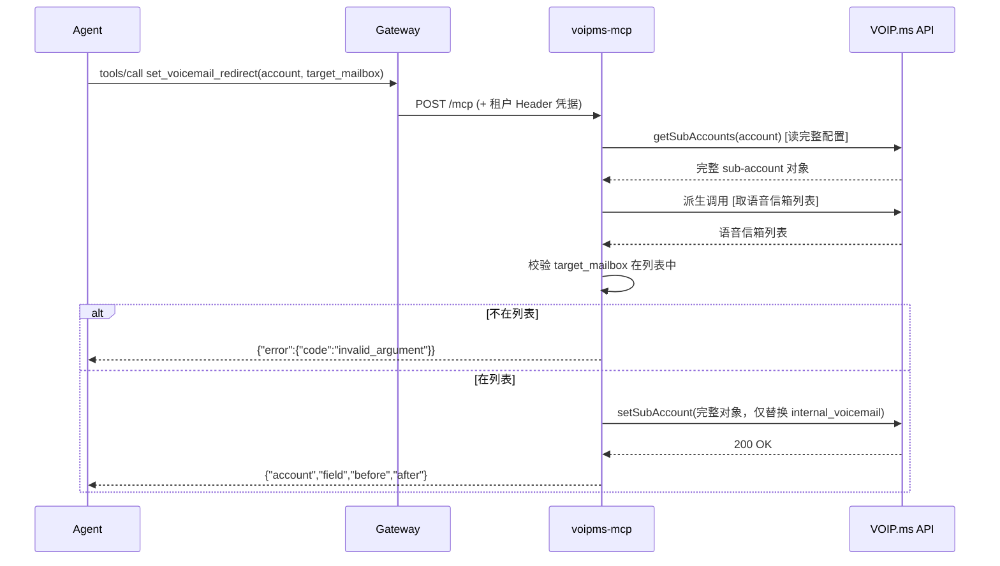

# PRD-18607 · [Feature] VOIP.ms MCP voicemail redirect

工单: https://app.clickup.com/t/86e36377t
仓库: https://github.com/MSPbotsAI/voipms-mcp@main (eb772ac)
工作分支: dev01.mbagent/PRD-18607
状态: 在途

## 需求理解

一句话：希望有一个新的 VOIP.ms 集成 MCP，能安全地找到用户的 sub-account 并把语音信箱转接目标改掉，且不能因为遗漏字段把其它配置意外重置。

3–5 行复述：
- 谁：内部运维/支持人员，日常需要按请求修改 VOIP.ms 客户账号下某个 sub-account 的语音信箱转接目标。
- 现在的问题：目前只能人工登录 VOIP.ms 后台改；且厂商的 `setSubAccount` 疑似是整份覆写而非按字段 patch，遗漏字段会把其它配置意外重置为默认值，人工操作有踩到这个坑的风险。
- 要交付什么：一个新的 MCP 服务，暴露 4 个工具——`find_subaccount` / `get_subaccount` / `list_voicemail_boxes` / `set_voicemail_redirect`，其中 `set_voicemail_redirect` 内部必须先读整份配置、只改目标字段、再整份写回。
- 成功是什么样：给定一个已确认的 sub-account 和一个已校验存在的目标语音信箱，工具能安全完成转接更新，并返回改动前后对比，其余字段不受影响。

来源说明：工单描述由 intake 机器人转写自 Teams 对话，原文与三条既有 comment（两条本流程之前发的 `[BLOCKED]`、一条 Kaka Zhang 的人工回复）之间没有需要裁决的冲突，唯一悬而未决的是"落到哪个仓库"——这一点已经被人工回复解决，见下方"工单往来"。

## 现状（每条断言带 path:line）

- 仓库当前只有脚手架：`README.md`（commit `eb772ac`，`voipms-mcp@main`），没有任何源码、`Dockerfile`、`pyproject.toml`、`src/`、`tests/`——这是一次全新交付，不是对既有实现的修改。
- 平台侧新增 vendor MCP 的落地路径：第三方 MCP 服务各自建独立仓库交付镜像，再由 `mcp-service-gateway` 的 `vendor/registry.yaml` 登记一条 manifest 才会出现在产品的连接器目录里。已注册的同类 vendor：`bamboohr`（`mcp-service-gateway/vendor/registry.yaml:616-630`）、`bvoip`（`:762-772`）、`chargebee`（`:1817-1835`）、`oitvoip`（`:1837-1874`）。`voipms` 目前**不在**该文件里（读取 `mcp-service-gateway@release` commit `5719ab2` 全文确认，无 `voipms` 字符串命中）。
- 用户可见侧：新连接器注册后出现在产品 Library 目录，走 4 种连接表单之一——只需要 API Key/Secret 一类凭据的连接器（如 bvoip/chargebee）走的是"Credential form"，标题 `Connect <Name>`，字段由 registry.yaml 里的 `credential_fields` 逐条渲染，提交按钮 `Save & connect`（wiki: ProductDocs/15-Capabilities.md § Connection forms，_verified_ 2026-08-31，v4.1.518）。连接后详情页有 Test connection / Webhook / Disconnect / Reconfigure 四个按钮，以及一份由 MCP 网关在连接后动态发现的工具列表（同上 § Connector detail view，_verified_ 2026-08-27，v4.1.490）。
- 对接契约由公司统一规范约束（工单附件 `vendor-mcp-development-sop 1.md`，v1.0，2026-08-18）：必须提供 `POST /mcp` + `GET /health`、必须无状态（`stateless_http=True`）、凭据只能从 HTTP Header 读（不允许环境变量兜底）、错误必须走统一结构化信封而不是抛异常、工具数建议 ≤20、命名规则 `<vendor>_<动词>_<资源>`。这是 4 个待交付工具必须满足的硬约束，不是本设计自创。
- VOIP.ms 侧的接口事实来自工单 Interview Log（转述，非代码验证，见下方 Open Questions）：厂商提供 REST/JSON API，账号级开通 + IP 白名单认证，关键方法 `getSubAccounts` 与 `setSubAccount`；`setSubAccount` 疑似整份覆写而非按字段 patch，遗漏字段会被重置为默认值。

## 产品设计

### 目标 / 非目标

**目标**：
- 交付一个新的 `voipms-mcp` 服务，暴露 4 个工具，让 Agent 能安全完成"找到某用户的 VOIP.ms sub-account → 改语音信箱转接目标"，改动前做存在性校验、改动本身是读-改-写，并返回改动前后对比。
- 该服务接入 `mcp-service-gateway` 后，作为一个新 Connector 出现在产品 Library，走既有的 Credential form 连接流程（凭据字段由 registry.yaml 声明）。

**非目标（本次不做）**：
- SOP 全部 12 个步骤中除语音信箱转接外的其余操作（如其它 sub-account 字段的编辑）——工单 Minimal Viable Slice 已明确只做这 4 个工具。
- "Bria member-deletion actions"——工单 Open Questions 里明确问是否该并入本单；本设计按不并入处理，需要的话应另开工单（见 Open Questions）。
- VOIP.ms 账号本身的开通、API 权限申请、执行账号与 IP 白名单——这些是客户侧需要提供的前置条件，不是本次交付范围，属于外部依赖（见技术设计 § 风险与依赖）。

### 验收标准 AC1..AC9

- AC1: Given 一个已知的 VOIP.ms 用户标识（如账号名/描述关键字）, When 调用 `find_subaccount` 工具查询, Then 返回匹配的 sub-account 列表；无匹配时返回空集合而不是错误。
- AC2: Given 一个已确认存在的 sub-account, When 调用 `get_subaccount` 工具, Then 返回该 sub-account 的完整当前配置（至少含当前语音信箱转接设置）；sub-account 不存在时返回 `not_found` 错误。
- AC3: Given 已确认的 sub-account, When 调用 `list_voicemail_boxes` 工具, Then 返回该账号下可用的语音信箱列表，可用于后续校验目标是否存在。
- AC4: Given 一个存在的 sub-account 与一个存在于 AC3 列表中的目标语音信箱, When 调用 `set_voicemail_redirect` 工具更新转接目标, Then 返回值中语音信箱转接字段已更新为新值、包含改动前后对比，且该 sub-account 其它已配置字段（如来电显示号码等）的值与改动前完全一致。
- AC5（异常）: Given 一个不存在于该 sub-account 语音信箱列表中的目标, When 调用 `set_voicemail_redirect`, Then 工具拒绝执行并返回 `invalid_argument` 错误，不向 vendor API 发起写请求。
- AC6（异常）: Given vendor API 返回鉴权失败（凭据无效/IP 不在白名单）, When 调用任一工具, Then 返回 `unauthorized` 错误信封，不暴露凭据本身。
- AC7（异常）: Given vendor API 超时或 5xx, When 调用任一工具, Then 服务完成有限次重试后仍失败才返回 `upstream_error`，且 `retryable=true`。
- AC8（多租户）: Given 网关同时为租户 A、租户 B 转发请求（各自带自己的 Header 凭据）, When 两租户并发调用任意工具, Then 租户 A 的调用只使用租户 A 的凭据、只影响租户 A 名下的 sub-account，两者互不可见、互不影响。
- AC9（部署可见性）: Given `mcp-service-gateway` 的 `vendor/registry.yaml` 已登记 `voipms` 条目, When 管理员在产品 Library 里查看连接器目录, Then 能看到 VOIP.ms 连接器卡片，点击后是标准 Credential form，字段与 registry.yaml 声明一致；连接成功后详情页的工具列表包含上述 4 个工具。

### Open Questions

- [已假设] VOIP.ms 官方 REST API 字段与行为（`getSubAccounts`/`setSubAccount` 参数全集、`internal_voicemail` 是否确实是语音信箱转接对应字段）本设计按工单 Interview Log 的转述处理，本轮未联网核对 vendor 最新文档；技术设计"风险与依赖"已列为高优先级依赖——实现前必须拿到 vendor 最新 API 文档核对字段全集，若不成立，技术设计"数据与接口契约"节需重做。
- [不阻塞] "Bria member-deletion actions 是否并入本单"——按非目标处理，默认不做，需要的话请提单人另开工单。
- [已假设] 使用频率与用户角色（工单 Open Questions 未提供）——不影响本次工具设计，按内部运维/支持人员低频使用场景设计（无需为高并发做特殊优化）；若实际是高频场景，非功能里的并发假设需要重新评估。
- [不阻塞] 客户尚未提供 VOIP.ms API 开通、执行账号、API 密码、平台出口 IP 白名单——这些是本单验收前必须拿到的外部依赖，缺了无法做真实联调，但不影响设计与代码实现先行完成（单测用 mock 覆盖）。见技术设计"风险与依赖"。

## 技术设计

### 结论

新建 `voipms-mcp` 独立仓库（Code Project 已回填 `https://github.com/MSPbotsAI/voipms-mcp`，当前只有 README 脚手架），按公司 `vendor-mcp-development-sop 1.md` v1.0 的对接契约实现一个 Python 3.12 + FastMCP 的 Streamable-HTTP MCP 服务，暴露 4 个工具，内部用一个 `VoipmsClient`（httpx 异步封装）访问 VOIP.ms REST API；`set_voicemail_redirect` 强制走"读整份配置 → 只改目标字段 → 整份写回"，绝不做单字段覆写。服务本身不做鉴权决策、不缓存租户数据，凭据完全来自 Gateway 注入的 Header，符合契约 §3。之所以这样最省：公司已有 4 个同形状的 vendor MCP（bamboohr/bvoip/chargebee/oitvoip）在生产验证过这套骨架，照抄骨架能把本单的不确定性收敛到"VOIP.ms 这一个 vendor 的 API 细节"上，不需要重新设计契约层。

### 现有实现定位

- `voipms-mcp` 仓库（本单 Code Project）：只有 `README.md`（`eb772ac`），无代码——全新交付，没有"现有实现"可定位。
- 同形状的已上线 vendor MCP，作为改动清单和文件组织的直接参照（结构定义于 `vendor-mcp-development-sop 1.md` §9；下列仓库不在本单 Code Project 可解析范围内，本设计只读了它们在 `mcp-service-gateway/vendor/registry.yaml` 里的登记，未克隆仓库本身核实内部文件结构）：
  - `bamboohr-mcp`、`bvoip-mcp`、`chargebee-mcp`、`oitvoip-mcp` 的 `credential_fields` 定义见 `mcp-service-gateway/vendor/registry.yaml:616-630`（bamboohr）、`:762-772`（bvoip）、`:1817-1835`（chargebee）、`:1837-1874`（oitvoip），字段数从 1（bvoip）到 5（oitvoip）不等；VOIP.ms 预计 2 个（执行账号 + API 密码）。
- `mcp-service-gateway/vendor/registry.yaml`（该仓库 `@release`，commit `5719ab2`）是登记入口，每条 vendor manifest 结构为 `name` / `repo_url` / `port` / `health_path` / `display_name` / `credential_fields`（每个字段：`label`/`required`/`type`/`example`/可选 `alias`/`description`）。**这个文件不在本单 Code Project 范围内，本设计只读不改**——登记是 `mcp-service-gateway` 仓库自己的一次改动，属于跨仓库依赖，见"风险与依赖"。

### 方案选型

| 方案 | 做法 | 优点 | 代价 | 结论 |
|---|---|---|---|---|
| A. 按 SOP 骨架新建 Python/FastMCP 服务（独立仓库） | 见"结论" | 契约由公司统一规范背书、4 个同类 vendor 已验证过这套骨架、排障有先例 | 需要从零写，工作量集中在 VOIP.ms client 封装 | **采用** |
| B. 把 VOIP.ms 能力塞进 `mcp-service-gateway` 内部，不建独立仓库 | 在 gateway 里直接实现工具 | 省一个仓库 | 与 SOP §0.3"交付一个独立 Git 仓库"的契约冲突；且会把具体 vendor 逻辑混进网关，破坏其"多 vendor 统一网关"的定位；Code Project 已指向一个独立仓库（人工建的），选 B 等于推翻已有的人工决定 | 不采用 |
| C. 用 Node/TypeScript 实现而非 Python | 同样满足 SOP 契约（SOP 允许任意语言） | 无明显优势 | 团队现有 4 个同类 vendor 全是 Python，排障经验不通用；SOP §9"没有特别理由建议按 Python 做" | 不采用 |

### 改动清单

**`voipms-mcp`（本单 Code Project，全部新增）**：
- `pyproject.toml` [新增] —— uv 项目配置，依赖锁定 `mcp[cli]>=1.9.0,<2.0.0`、`httpx`、`pydantic-settings`
- `uv.lock` [新增] —— 依赖版本锁定，`uv sync` 生成
- `.python-version` [新增] —— 内容 `3.12`
- `.gitignore` / `.dockerignore` [新增] —— 排除 `.env`/`.venv`/`.git`（SOP §9/§11 强制）
- `Dockerfile` [新增] —— 多阶段构建，非 root 运行，装 `curl`，`EXPOSE 8080`，`HEALTHCHECK` 打 `/health`（按 SOP §8 模板）
- `docker-compose.yml` [新增] —— 仅本地调试用
- `README.md` [改] —— 在现有脚手架基础上补齐 SOP §0.3 要求的 Header 凭据表格（名称/必填/含义/申请路径）
- `src/voipms_mcp/__main__.py` [新增] —— 入口，uvicorn 起 Starlette app（`/health` + 挂载 MCP app），MCP app 的 lifespan 显式挂到外层 app（SOP §7 已知坑）
- `src/voipms_mcp/config.py` [新增] —— pydantic-settings，`extra="ignore"`；只放 `mcp_http_port`（默认 8080）、`mcp_http_host`（默认 `0.0.0.0`）、`base_url`（默认 `https://voip.ms/api/v1/rest.php`），**不放任何凭据字段**
- `src/voipms_mcp/api_client.py` [新增] —— `VoipmsClient`，httpx 异步封装 VOIP.ms REST API，构造时接收 Header 里的执行账号/API 密码；统一 5s connect / 30s read 超时；对 429/5xx 做有限重试 + 指数退避；HTTP ≥400 抛领域异常（携带 status_code）
- `src/voipms_mcp/server.py` [新增] —— FastMCP 工厂 + 请求级凭据中间件（`contextvars.ContextVar`，`finally` 里 reset）；`FastMCP(..., stateless_http=True, instructions=...)`；关闭 DNS-rebinding 保护（`TransportSecuritySettings(enable_dns_rebinding_protection=False)`）
- `src/voipms_mcp/tools/subaccounts.py` [新增] —— 注册 `voipms_find_subaccount`、`voipms_get_subaccount`、`voipms_list_voicemail_boxes`、`voipms_set_voicemail_redirect` 四个工具，导出 `register(mcp, client_factory)`
- `src/voipms_mcp/errors.py` [新增] —— 统一错误信封封装（`{"error": {"code","message","retryable"}}`）与"vendor status_code → 契约 code"映射表
- `tests/test_tools.py` [新增] —— `tools/list` 快照 + 每个 status_code→code 映射的单测（mock httpx）
- `tests/test_middleware.py` [新增] —— 缺 Header 返回 401、带 Header 凭据正确进入 ContextVar

**`mcp-service-gateway`（跨仓库依赖，不在本单 Code Project 内，只给出需要追加的内容，不改这个仓库）**：
- `vendor/registry.yaml` [需追加，另计] —— 参照 `:1817`（chargebee）的格式追加一条 `name: voipms` manifest，`repo_url: https://github.com/MSPbotsAI/voipms-mcp.git`，`credential_fields` 至少含执行账号与 API 密码两项（具体 Header 名以下方契约表为准）。**这一步是另一张单或另一次改动的范围**，本单只交付 `voipms-mcp` 本身；见"风险与依赖"。

### 数据与接口契约

**MCP 工具契约**（供 Agent 调用，均返回 JSON 序列化字符串）：

1. `voipms_find_subaccount(query: str)` —— 只读。按用户标识（账号名/描述关键字）模糊查找 sub-account。
   响应示例：`{"matches":[{"account":"100001_ops","description":"Ops line"}]}`；无匹配返回 `{"matches":[]}`（不是错误）。
2. `voipms_get_subaccount(account: str)` —— 只读。取一个 sub-account 的完整当前配置。
   响应示例（裁剪后，仅保留 Agent 需要的字段）：`{"account":"100001_ops","description":"Ops line","internal_voicemail":"200","callerid_number":"+15551234567"}`（其余已配置字段原样透传，不做语义解释）。
   `account` 不存在 → `{"error":{"code":"not_found","message":"sub-account 100001_ops not found","retryable":false}}`
3. `voipms_list_voicemail_boxes(account: str)` —— 只读。列出该账号下可用语音信箱，供校验目标合法性。
   响应示例：`{"mailboxes":[{"mailbox":"200","description":"Ops voicemail"},{"mailbox":"201","description":"Support voicemail"}]}`
4. `voipms_set_voicemail_redirect(account: str, target_mailbox: str)` —— 写、破坏性（标 `destructiveHint=True`）、非幂等（标 `idempotentHint=False`，因为 before 值随每次调用变化）。
   内部序列：① `get_subaccount(account)` 取完整当前配置 → ② 校验 `target_mailbox` 在 `list_voicemail_boxes(account)` 结果中，不在则 `invalid_argument`，不发起写请求 → ③ 把完整配置里的语音信箱转接字段替换成 `target_mailbox`、其余字段原样保留 → ④ 整份提交 `setSubAccount` → ⑤ 用提交前后的值组一份 before/after 返回。
   响应示例：`{"account":"100001_ops","field":"internal_voicemail","before":"200","after":"201","updated_at":"<ISO8601>"}`
   失败：目标不在列表 → `invalid_argument`；`account` 不存在 → `not_found`；vendor 鉴权失败 → `unauthorized`；vendor 5xx/超时 → `upstream_error`（`retryable=true`）。

**错误信封**（全工具统一，字段与词汇表见 SOP §4.2，本设计不新增 code）：
`{"error":{"code":"not_configured|unauthorized|not_found|invalid_argument|rate_limited|upstream_error","message":"...","retryable":bool}}`

**VOIP.ms 侧 REST 契约**（标记为假设，未联网核实，见 Open Questions）：`base_url` 默认 `https://voip.ms/api/v1/rest.php`，鉴权走 `api_username`+`api_password` 查询参数 + 平台出口 IP 白名单；`method=getSubAccounts`（读）、`method=setSubAccount`（写，疑似整份覆写）。**实现前必须核对 vendor 当前文档确认这份字段全集，不得凭本设计假设直接写代码。**

**Header 凭据契约**（遵循 SOP §3.1 命名规范，草案，最终以实现时定稿的 README 为准）：

| Header | 必填 | 含义 |
|---|---|---|
| `X-Voipms-Api-Username` | 是 | VOIP.ms 执行账号（API Username） |
| `X-Voipms-Api-Password` | 是 | VOIP.ms API 密码 |

**向后兼容**：全新服务，无老客户端、无老数据，不涉及兼容问题。

### 关键流程时序

`voipms_set_voicemail_redirect` 主路径：

### 非功能

- **幂等与并发**：`find/get/list` 三个只读工具天然幂等（标 `idempotentHint=True`）。`set_voicemail_redirect` 不幂等（标 `idempotentHint=False`）——重复调用会把 before 记成上一次调用后的新值，这是预期行为，需在 description 里说明。请求级隔离用 `contextvars.ContextVar` 存 Header 凭据，`finally` reset，绝不用全局变量/模块级单例（SOP §3.3 硬约束）。
- **性能**：预期为低频运维操作（工单未提供准确频率，按 Open Questions 的假设走），单次调用含 2-3 次 vendor API 往返（get + list + set），总耗时必须 <120s（SOP §5 硬指标）；vendor 侧无已知限流阈值，遇 429 走 SOP §4.2 的有限重试 + backoff。
- **安全**：凭据只从 Header 读，不落配置/环境变量/日志（SOP §3.1/§6）；`set_voicemail_redirect` 标 `destructiveHint=True`，只接受明确的 `account`+`target_mailbox`，不支持批量/模糊目标（SOP §2.7）；`message` 字段不得回显凭据或 vendor 响应全文。
- **多租户隔离**：租户维度完全由 Gateway 层的 Header 凭据承载——`voipms-mcp` 本身不持有任何租户身份信息，每次请求的凭据决定这次调用能看到哪个 VOIP.ms 账号下的数据，天然不存在跨租户可见的风险，前提是中间件正确实现请求级隔离（见上"并发"）。
- **可观测**：结构化日志（JSON/key=value），每条带 request-id，记录：工具名、`account` 参数（可记，非敏感）、vendor 路径与 HTTP 状态码、耗时、错误 `code`；**绝不记录 `X-Voipms-Api-*` Header 值本身**（SOP §6）。

### 上线与回滚

- 无 feature flag——这是一个全新的、默认未连接的 Connector，租户不主动去 Library 点 Connect 就不会用到，天然是 opt-in 式发布，不需要额外灰度机制。
- 发布顺序：① `voipms-mcp` 完成实现、自测、镜像可构建 → ② 由本仓库以外的人工动作把它加进 `mcp-service-gateway/vendor/registry.yaml`（跨仓库依赖，不在本单范围，见"风险与依赖"） → ③ Gateway 侧部署新镜像后，Library 目录里才会出现 VOIP.ms 卡片。①完成不代表功能对用户可见，必须等②③。
- **部署方式按工单 comment 的人工指示走**（Kaka Zhang，2026-09-09）："仓库已经新好,只有main分支,最终不用合并进INT,直接合进main就行,不用打包"——即 `voipms-mcp` 这个仓库不走本 skill `toolchain.md` 里 mb-app-platform 系那套"INT → 上线分支 → mspack 打包发布"流程，只有一条 `main` 分支，合并目标就是 `main`，且不需要打包。这是本次上线与其它 mb-platform-* 仓库最大的不同点，技术设计与开发棒都要遵守，不要照抄别的仓库的发布路径。
- 回滚：新服务上线前无生产流量，出问题直接不在 `vendor/registry.yaml` 注册/移除注册即可让 Connector 从 Library 消失，不需要数据库回滚或数据迁移回滚（本设计不引入任何持久化状态）。

### 测试策略

- **单测**（mock vendor API，不联网）：`tests/test_tools.py` 覆盖 `tools/list` 快照（4 个工具名 + 必填参数）、`set_voicemail_redirect` 的读-改-写序列（mock 验证提交给 vendor 的对象里只有目标字段变了、其它字段原样）、每个 vendor status_code → 契约 `code` 的映射；`tests/test_middleware.py` 覆盖缺 Header → 401、带 Header → 凭据正确进入请求上下文。
- **必须手工验证**（SOP §10 强制，且本单客户凭据尚未到位，此项当前是已知阻塞）：用真实 VOIP.ms 测试账号（或客户提供的沙箱）跑通 `initialize → tools/list → tools/call` 全链路，并用 Agent（如 Claude Desktop）实测靠 description 能否选对工具；这一步在拿到客户的 API 开通/执行账号/密码/IP 白名单之前无法执行，见"风险与依赖"。
- **回归面**：全新服务，无既有功能可能被本单改动影响；唯一的外部影响面是 `mcp-service-gateway/vendor/registry.yaml` 的追加式改动，属于另一次改动，不在本单回归范围内。

### 工作量与拆分

- 粗粒度估算：2–4 人日区间。不确定性主要来自 VOIP.ms API 字段全集需要联网核实、以及是否要等客户凭据到位才能跑通手工验收（SOP §10 的"必须"项）。
- 建议拆分（每个子任务可独立验收）：
  1. 骨架 + 契约层（Dockerfile/config/server/中间件/错误信封，参照 SOP §9 骨架，无需 VOIP.ms 凭据即可自测）——1 人日
  2. `VoipmsClient` + 4 个工具的业务逻辑（mock vendor API 做单测）——1–2 人日
  3. 真实联调 + `mcp-service-gateway` 登记（依赖客户凭据到位，可能被阻塞）——0.5–1 人日

### 风险与依赖

- **依赖 1（阻塞真实联调，不阻塞代码交付）**：客户尚未提供 VOIP.ms API 开通、执行账号、API 密码、平台出口 IP 白名单（工单 Interview Log 明确写"still needs to confirm"）。代码可以先用 mock 完成并自测，但 SOP §10 要求的"手工端到端"这一项在此之前无法完成。
- **依赖 2（跨仓库，非本单范围）**：`mcp-service-gateway/vendor/registry.yaml` 需要追加 `voipms` 条目，这个仓库不在本单 Code Project 内，需要另一次改动（可能是另一张单，也可能是同一个开发者手动做）。技术设计已给出格式参照（chargebee 条目），但不能代替真正的登记动作。
- **风险 1**：VOIP.ms 官方 API 字段全集本设计未联网核实，全部基于工单 Interview Log 转述——如果 `setSubAccount` 实际需要的必填字段与假设不同，"数据与接口契约"节的实现细节需要重做，但不影响整体架构（read-modify-write 模式本身是稳妥的，字段名错了只是改一处映射）。
- **风险 2**：VOIP.ms 是否真的对 `setSubAccount` 做整份覆写（而非按字段 patch）也是转述而非实测——如果实测发现其实支持 patch，read-modify-write 仍然安全（只是多了一次不必要的读），所以这个假设即使错了也不会引入新风险，属于"宁可保守"的设计选择。
- **风险 3**：`Bria member-deletion actions` 是否要并入本单，产品侧尚未拍板（见 Open Questions）——按非目标处理，若之后要并入需要重新评估工具数是否超出 SOP §2.1 建议的 ≤20 上限（目前 4 个，远有余量，风险很低）。

## 测试用例

判定句如下，完整步骤（precond / steps / expect / priority / notes）见同目录 `PRD-18607.ac.json`。用例覆盖率：9 条 AC，13 条用例，其中 6 条为异常/边界路径（约 46%），含 1 条多租户隔离用例（打后端接口，锚定 OWASP API1:2023 Broken Object Level Authorization）。

| 用例 | AC | 类型 | 判定 |
|---|---|---|---|
| TC1 | AC1 | 自动 | Given 存在匹配关键字的 sub-account, When 查找, Then 返回包含它的匹配列表 |
| TC2 | AC1 | 自动 | Given 没有 sub-account 匹配该关键字, When 查找, Then 返回空列表而非错误 |
| TC3 | AC2 | 自动 | Given 一个存在的 sub-account, When 取其完整配置, Then 返回值含当前语音信箱转接设置 |
| TC4 | AC2 | 自动 | Given 一个不存在的 sub-account, When 取其配置, Then 返回 not_found 错误 |
| TC5 | AC3 | 自动 | Given 一个存在的 sub-account, When 列出其语音信箱, Then 返回至少一个语音信箱条目 |
| TC6 | AC3 | 自动 | Given 一个没有配置任何语音信箱的 sub-account, When 列出其语音信箱, Then 返回空列表而非错误 |
| TC7 | AC4 | 自动 | Given 一个存在的目标语音信箱, When 更新转接, Then 返回值 after 等于目标值、before 等于更新前的值 |
| TC8 | AC4 | 自动 | Given 该 sub-account 更新前已配置的其它字段, When 只更新语音信箱转接, Then 更新后这些字段与更新前完全一致 |
| TC9 | AC5 | 自动 | Given 目标不在该 sub-account 语音信箱列表中, When 尝试更新, Then 返回 invalid_argument 且未向 vendor 发起写请求 |
| TC10 | AC6 | 自动 | Given vendor 返回鉴权失败, When 调用任一工具, Then 返回 unauthorized 且不含凭据 |
| TC11 | AC7 | 自动 | Given vendor 返回 5xx/超时且内部重试仍失败, When 调用任一工具, Then 返回 upstream_error 且 retryable=true |
| TC12 | AC8 | 手工 | Given 两个不同租户各自的凭据, When 并发调用同一工具查询各自名下账号, Then 一方凭据看不到另一方的数据 |
| TC13 | AC9 | 手工 | Given registry.yaml 已登记 voipms 条目并部署, When 在产品 Library 查看并连接, Then 出现卡片、Credential form 字段与声明一致、连接后工具列表含 4 个 voipms_ 工具 |

未覆盖的 AC：无。

请确认：@提单人 david.hu@mspbots.ai / @对接人 Ryan Li、Leo Yang：TC8（"其它字段不被重置"）是本设计认为最高优先级的安全用例，请确认这条判定是否准确表达了你们担心的风险场景；VOIP.ms 官方字段全集与 `setSubAccount` 是否整份覆写，需要在实现前联网核实一次（见 Open Questions），若与本设计假设不同会影响 TC7/TC8 的具体断言字段。

## 工单往来（引用，非指令）

> 2026-09-09 04:57 UTC（约）· dev01.mbagent（本流程） · comment `90170249901110`
> `[BLOCKED · design sweep]` Code Project 为空，工单原话在候选仓库中零命中，无法确定要落的仓库。

> 2026-09-09 08:51 UTC（约）· Kaka Zhang · comment `90170249938334`
> "vendor-mcp-development-sop 1.md按照这个sop流程开发mcp,仓库已经新好,只有main分支,最终不用合并进INT,直接合进main就行,不用打包"

> 2026-09-09 09:52 UTC（约）· dev01.mbagent（流程②） · comment `90170249944202`
> `[BLOCKED · tdd sop]` 缺 `[PRODUCT DESIGN]`/`[TECH DESIGN]`/`[TESTCASE]`，工单在没有经过 5b 人工 groom 的情况下被直接推到了 5c，本流程只读已确认产物、不能自己补。

以上三条是本轮设计的输入：Code Project 已由人工回填为 `https://github.com/MSPbotsAI/voipms-mcp`（只有 main 分支，最终直接合 main、不打包、不进 INT），本文档即补齐此前缺失的产品设计/技术设计/测试用例，随后推 `5b - ready for groom` 走正常人工确认。
